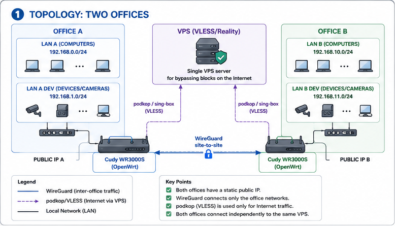
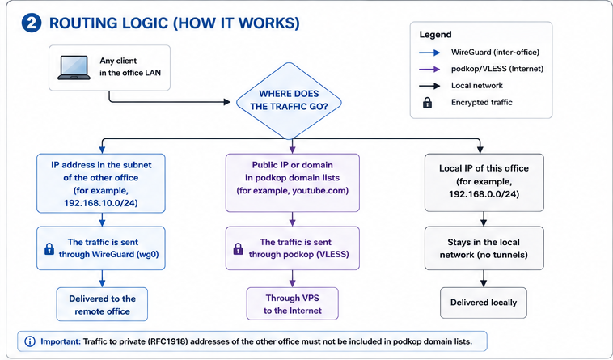
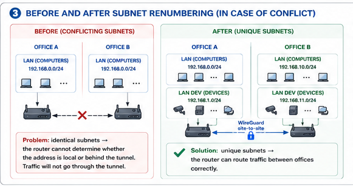
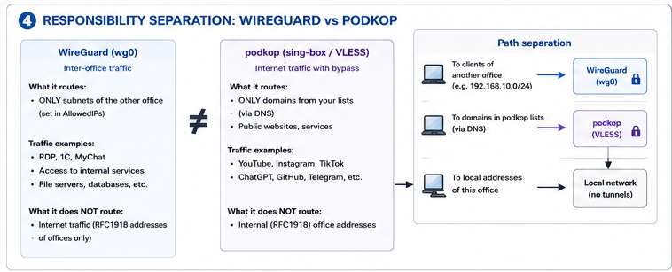
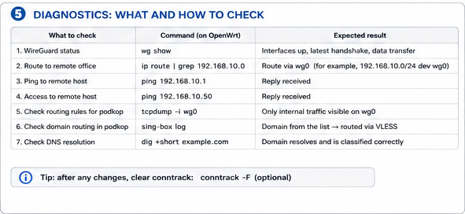
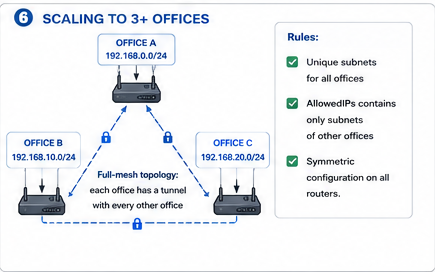
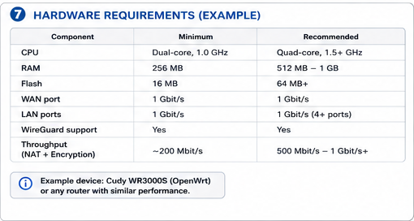

# Connecting Office Networks via WireGuard + OpenWrt/podkop

A practical architecture for merging the LANs of multiple offices into a
single routable network (site-to-site), while keeping censorship-bypass
routing via a VLESS subscription on OpenWrt routers (podkop / sing-box).

Replaces the "PPTP on every PC" scheme with a transparent network-level
tunnel: a user simply connects to an internal address in the remote office
(RDP, 1C, internal services) with no manual VPN client setup.

---

## Table of Contents

- [The Idea in a Nutshell](#the-idea-in-a-nutshell)
- [1. Topology](#1-topology)
- [2. Traffic Routing Logic](#2-traffic-routing-logic)
- [Addressing Requirement](#addressing-requirement)
- [3. Subnet Renumbering](#3-subnet-renumbering)
- [WireGuard Configuration (example)](#wireguard-configuration-example)
- [OpenWrt Firewall Zones](#openwrt-firewall-zones)
- [4. WireGuard vs podkop: Separation of Concerns](#4-wireguard-vs-podkop-separation-of-concerns)
- [podkop: Splitting Traffic by Domain](#podkop-splitting-traffic-by-domain)
- [5. Diagnostics](#5-diagnostics)
- [6. Scaling to 3+ Offices](#6-scaling-to-3-offices)
- [Address Migration Checklist](#address-migration-checklist)
- [7. Hardware Requirements](#7-hardware-requirements)
- [Disclaimer](#disclaimer)

---

## The Idea in a Nutshell

| | Before (PPTP) | After (WireGuard site-to-site) |
|---|---|---|
| Level | per-PC (client on every machine) | site-to-site (tunnel between routers) |
| End-user setup | VPN profile on every PC | not required |
| Access | manually chosen hosts | entire remote office subnet (or a subset, via ACL) |
| Cryptography | MS-CHAPv2 (insecure) | WireGuard (Curve25519 / ChaCha20) |
| Bypassing blocks | separate, unrelated | podkop/VLESS — an independent layer on top |

---

## 1. Topology



Both offices have a static public IP and run the same platform — Cudy
WR3000S on OpenWrt. A single VPS with VLESS/Reality is used by both
offices independently (these are two parallel connections to the same
server, not a shared tunnel).

---

## 2. Traffic Routing Logic



Every packet on the router follows one of three branches: local delivery
within its own subnet, WireGuard toward the other office, or internet
egress — either directly via NAT or through the podkop VLESS tunnel,
depending on whether the destination domain/address matches the proxied
lists.

---

## Addressing Requirement

Site-to-site merges networks **entirely** at the routing level — unlike
PPTP, where each client reached specific hosts individually. This implies
a hard requirement:

> **Office subnets must not overlap.** If two offices share the same range
> (e.g. `192.168.0.0/24` on both), the router cannot tell whether an
> address is local or on the other side of the tunnel — the local route
> always wins, and traffic simply never reaches WireGuard.

---

## 3. Subnet Renumbering



Rule of thumb for which office to renumber: **fewer devices, less work**.
Renumber the office with fewer static bindings (usually the one with
fewer cameras/printers/NVRs).

Recommended addressing scheme — office number in the second/third octet,
so the address is self-explanatory:

```
Office A: 192.168.0.0/24  (workstations)   192.168.1.0/24  (devices/cameras)
Office B: 192.168.10.0/24 (workstations)   192.168.11.0/24 (devices/cameras)
Office C: 192.168.20.0/24 (workstations)   192.168.21.0/24 (devices/cameras)
```

---

## WireGuard Configuration (example)

Both offices have static public IPs — the tunnel is fully symmetric, with
no NAT-traversal quirks.

**Office A** (`/etc/config/network` on OpenWrt, `wg0` interface):

```
config interface 'wg0'
    option proto 'wireguard'
    option private_key '<OFFICE_A_PRIVATE_KEY>'
    list addresses '10.99.0.1/30'

config wireguard_wg0
    option public_key '<OFFICE_B_PUBLIC_KEY>'
    option endpoint_host '<OFFICE_B_PUBLIC_IP>'
    option endpoint_port '51820'
    option persistent_keepalive '25'
    list allowed_ips '192.168.10.0/24'
    list allowed_ips '192.168.11.0/24'
```

**Office B** — mirrored, `allowed_ips` points to Office A's subnets:

```
config interface 'wg0'
    option proto 'wireguard'
    option private_key '<OFFICE_B_PRIVATE_KEY>'
    list addresses '10.99.0.2/30'

config wireguard_wg0
    option public_key '<OFFICE_A_PUBLIC_KEY>'
    option endpoint_host '<OFFICE_A_PUBLIC_IP>'
    option endpoint_port '51820'
    option persistent_keepalive '25'
    list allowed_ips '192.168.0.0/24'
    list allowed_ips '192.168.1.0/24'
```

> `persistent_keepalive` is useful even with both sides on static IPs — it
> helps the session recover faster after ISP-level reconnects/failovers.

---

## OpenWrt Firewall Zones

Create a dedicated zone for `wg0` and allow forwarding in both directions
with LAN, **without masquerade** (NAT is not needed for tunnel traffic —
addresses must arrive unmodified):

```
config zone
    option name 'wg'
    option input 'ACCEPT'
    option output 'ACCEPT'
    option forward 'ACCEPT'
    option masq '0'
    list network 'wg0'

config forwarding
    option src 'lan'
    option dest 'wg'

config forwarding
    option src 'wg'
    option dest 'lan'
```

For tighter access control (recommended over opening the whole subnet) —
add a `config rule` for specific ports (e.g. only `3389/tcp` to the
terminal-server subnet) instead of a blanket `forwarding` block.

---

## 4. WireGuard vs podkop: Separation of Concerns



The key architectural point — these two tunnels solve **different
problems** and their routes should not overlap:

- **WireGuard** — inter-office traffic (RDP, 1C, MyChat, access to
  internal resources). Routes only packets addressed to the other
  office's subnet (`AllowedIPs`).
- **podkop (sing-box/VLESS)** — internet traffic for a given office that
  needs to bypass blocks. Operates on domain lists resolved via DNS.

> Traffic to the other office's internal (RFC1918) addresses should never
> land in podkop's domain lists — in practice this doesn't conflict, but
> it's worth explicitly verifying after setup (see [5. Diagnostics](#5-diagnostics)).

---

## podkop: Splitting Traffic by Domain

- Runs independently of WireGuard, establishing its own sing-box/VLESS
  client to the shared VPS.
- Matching is domain-list based (geosite/custom lists), determined via
  client DNS queries.
- **Client DNS must point to the router itself** (handed out via DHCP),
  and the WAN side must not have transparent DNS redirection further up
  the chain — otherwise podkop won't see the relevant queries.
- NAT (masquerade) on the WAN zone for VLESS traffic is standard — no
  changes needed from the default configuration.

---

## 5. Diagnostics



```bash
# which interface will actually be used for an address
ip route get 192.168.10.15

# WireGuard peer status, last handshake, traffic counters
wg show

# verify that traffic to the other office is NOT leaking into VLESS
tcpdump -ni wg0 host 192.168.10.15

# verify that domains from the proxy lists are actually being matched
logread | grep podkop
```

Sign of a correct setup: `wg show` shows a recent `latest handshake` and
growing `transfer`, and `ip route get <other-office-IP>` points to the
`wg0` interface, not `wan`/the VLESS interface.

---

## 6. Scaling to 3+ Offices



| Criterion | Hub-and-spoke | Full mesh |
|---|---|---|
| Number of tunnels | N−1 | N×(N−1)/2 |
| Traffic between "leaf" offices | transits through the hub | direct |
| Single point of failure | hub — critical | none |
| When it's justified | offices mainly talk to the central one (A) | 4-5+ offices with active cross-traffic |

For a 2-office start this choice isn't relevant yet — it becomes
significant once a third office and beyond are added.

---

## Address Migration Checklist

Before moving an office to a new subnet — go through the list and record
everything running on a static IP:

| Device | Old IP | New IP | Where else the address appears (links/configs) | Done |
|---|---|---|---|---|
| Camera 1 | | | NVR, shortcuts | ☐ |
| Camera 2 | | | NVR | ☐ |
| NVR/DVR | | | — | ☐ |
| Printer | | | PC drivers | ☐ |
| NAS | | | shortcuts, backup scripts | ☐ |
| 1C server (if referenced by IP) | | | client 1C databases | ☐ |
| RDP shortcuts on desktops | — | — | replace IP with a DNS name if possible | ☐ |

> Recommendation: switch from static IPs to DNS names wherever possible
> (local DNS/hosts) — this makes future address migrations painless.

---

## 7. Hardware Requirements



Current load (RDP, 1C, MyChat, browsing from within the remote session) is
light in terms of throughput — a typical Cudy WR3000S (2×A53 ~1.3 GHz,
1 GB RAM) handles NAT + podkop + WireGuard simultaneously without
slowdowns.

As load grows (video calls, more offices/sessions), upgrading to a
beefier SoC (4 cores, 1 GB RAM, 512 MB flash) requires no architectural
changes — the config from the current router carries over almost
one-to-one, with only interface addresses changing.

---

## Disclaimer

The example configs are a starting point, not a drop-in production
solution. Before going live:
- generate real WireGuard keys (`wg genkey` / `wg pubkey`);
- narrow down `AllowedIPs`/firewall rules to the necessary ports and
  hosts only;
- test failure scenarios (link drop, router reboot).
